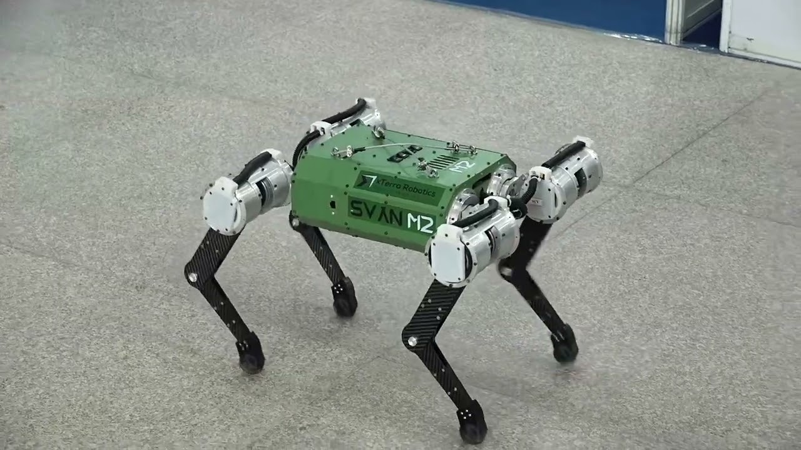
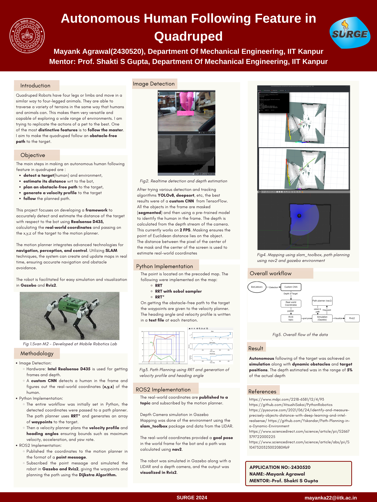

# Autonomous Human Following Feature in Quadruped

## SURGE 2024
### Under Prof Shakti S. Gupta
### MRL Robotics Labs 

Link to report: 
https://drive.google.com/file/d/1K7Vp2FHSWGIjxEpKjeS06gsRTfFwnUGr/view?usp=sharing

Link to poster:
https://drive.google.com/file/d/13tLJ2KR6yYEMqxYgfVmvRbxWn_1Gyeap/view?usp=sharing

Improvements in robotics, artificial intelligence, and machine learning
 have made quadruped robots more capable, reliable, and versatile,
 driving their adoption across various industries. As the global
 population ages, there is a rising demand for assistive technologies
 that can help the elderly maintain their independence, with quadruped
 robots being a potential solution.Unlike wheeled robots, quadruped
 robots can navigate uneven terrain, stairs, and obstacles, making
 them suitable for a wide range of applications, from urban
 environments to remote areas.Quadruped robots can assist
 individuals with mobility issues by following them and carrying items
 such as groceries, bags, or medical supplies, reducing the physical
 burden on the user.As companions for elderly or disabled individuals,
 these robots can provide company, monitor the health of their owners,
 and even alert medical personnel in case of emergencies
